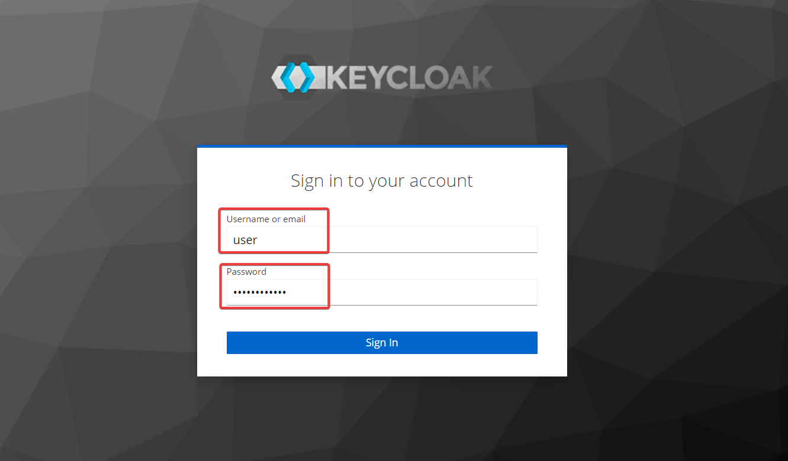

# OSDU Baremetal helm chart

**NOTE**: We recommend **against upgrading to a newer version**, as it is neither supported nor advisable.

**NOTE**: Check that you're in **release branch** (example release/0.22). Master branch can be unstable due to development

The chart can install all the required infrastructure applications (intended to replace cloud-native solutions like pub/sub, cloud storage, and datastore for baremetal solutions) and OSDU services on a [Kubernetes](https://kubernetes.io) cluster using the [Helm](https://helm.sh) package manager.
> **The infrastructure is not production ready and provided for informational purposes only**.

**NOTE**: Installing the OSDU Baremetal Helm chart in namespaces **other than the default namespace is generally not supported** and can lead to unpredictable behaviour.If deployment in a different namespace is absolutely necessary, be prepared to invest time in customizing configurations and thoroughly testing to ensure all aspects function correctly.

Infrastructure Components added to the OSDU Baremetal helm chart:

* [Airflow](https://github.com/bitnami/charts/tree/master/bitnami/airflow) (chart version 13.0.5, application version 2.3.3)
* [Elasticsearch](https://github.com/bitnami/charts/tree/master/bitnami/elasticsearch) (chart version 17.9.29, application version 7.17.3)
* [Keycloak](https://github.com/bitnami/charts/tree/master/bitnami/keycloak) (chart version 14.0.1, application version 21.0.2)
* [MinIO](https://github.com/bitnami/charts/tree/master/bitnami/minio) (chart version 12.6.3, application version 2023.5.18)
* [Postgresql](https://github.com/bitnami/charts/tree/master/bitnami/postgresql) (chart version 12.4.3, application version 15.2.0)
* [RabbitMQ](https://github.com/bitnami/charts/tree/master/bitnami/rabbitmq) (chart version 11.15.2, application version 3.11.15)

On baremetal the helm chart can be installed in **two modes**:

* Light mode
* Service Mesh mode

## Light mode

Helm chart installs OSDU to the namespace **not labeled by Istio**. [^3]

* Istio sidecar injection is enabled only for `Partition`, `Entitlements`, `Indexer` and `File` OSDU Services on per-pod basis to meet basic security requirements. In this case Istio security policies are applied and Istio performs requests authentication function.
* It requires fewer hardware resources.
* Istio is required and used for traffic routing.

### Service Mesh mode

Helm chart is installed to the namespace **labeled by Istio**. [^3]

* In this case each pod works with an Istio sidecar injected. Istio executes requests authentication function and additionally provides all opportunities of Servise Mesh, like mutual TLS, collection of telemetry data, fine-grained control of traffic behavior, etc.
* It requires more hardware resources than Light mode. [^4]

## Prerequisites

Before starting installation, please ensure that all the required tools and resources are ready and configured.
The steps to install the helm charts in one of the two, Light or Service Mesh, modes follow the instructions as below, respectively:

* **To install the helm charts in Light mode perform steps 1 to 4 and verify the requirements as in step 6.**
* **To install the helm charts in Service Mesh mode perform the steps 1 to 5 and verify the requirements as in step 6.**

### 1. Operating system

The code works on Debian-based Linux (Debian 10+ and Ubuntu 20.04+) and Windows WSL 2. All other operating systems, including macOS and Google Cloud Shell, are not verified and supported.

### 2. Packages

Packages needed for installation from a local computer.

* **Kubectl** (version: v1.27.0 or higher) [kubectl](https://kubernetes.io/docs/tasks/tools/#kubectl)[^1]
* **HELM** (version: v3.12.0 or higher) [helm](https://helm.sh/docs/intro/install/)[^1]
* **Git** (version: v2.25 or higher) [git](https://git-scm.com/downloads)[^1]

### 3. Kubernetes cluster

Create a kubernetes cluster with the following requirements:

* **Hardware resources**
The minimum hardware requirements differ for two modes of Helm installation *(described below)*:
  * For Light mode minimum 4 vCPUs and 24 GB of RAM should be available cumulatively in all nodes.
  * For Service Mesh mode minimum 8 vCPUs and 27 GB of RAM should be available cumulatively in all nodes.
* **Storage Class**
All OSDU services are stateless and don't require any persistent volumes. However, if you deploy infrastructure dependencies, you need to specify the storage class with the command below:

    ```sh
    kubectl annotate sc <STORAGE_CLASS_NAME> "storageclass.kubernetes.io/is-default-class"="true"
    ```

  The minimum recommended storage requests for all infrastructure's persistent volumes are 55 GB.

### 4. Install ISTIO in cluster

Install ISTIO, version 1.17.2 or above, this installation has been tested with **default** installation configuration profile.

Visit [this site](https://istio.io/latest/docs/setup/getting-started/) for detailed information about how to install ISTIO in your cluster.

To learn more about ISTIO installation configuration profile visit [this link](https://istio.io/latest/docs/setup/additional-setup/config-profiles/).

### 5. Add namespace label (for Service Mesh mode)

***This step is required to install the helm charts in Service Mesh mode.***
Add a namespace label, to application &lt;namespace&gt; to instruct Istio to automatically inject Envoy sidecar proxies when you deploy your application later.
To add the namespace run the following command, replace &lt;namespace&gt; with the namespace in which your application would be installed

```sh
kubectl label namespace <namespace> istio-injection=enabled
```

### 6. HTTP/HTTPS modes

OSDU Baremetal helm chart supports both HTTP and HTTPS modes.

Switching between `HTTP` and `HTTPS` mode is done by setting the value of `global.useHttps` to either `true` for HTTPS or `false` for HTTP.

Enabling HTTPS requires proper TLS certificates for each domain to be created and added to Kubernetes cluster as secrets before the installation of OSDU Baremetal helm chart.

Creation of certificates and Kubernetes secrets is currently not automated and requires manual configuration by experienced engineer. Below we provide additional information regarding some details of HTTPS configuration.

#### HTTPS Configuration

To enable OSDU Baremetal helm chart simple installation with HTTPS the value of `global.useHttps` must be set to `true`.

TLS certificates must be created for the following domains:

* `osdu.<domain>`
* `airflow.<domain>`
* `keycloak.<domain>`
* `minio.<domain>`
* `s3.<domain>`

Detail instructions how to obtain TLS certificates and create Kubernetes secrets are avaliable [here](../../examples/tls_certs_config/README.md).

As a result Kubernetes secrets of type `kubernetes.io/tls` should be created. Afterwards following values must be provided during installation:

| Name                                  | Description                                                            | Type   | Example                | Required |
| ------------------------------------- | ---------------------------------------------------------------------- | ------ | ---------------------- | :------: |
| **domain.tls.osduCredentialName**     | Secret name that contains TLS certificate for `osdu` subdomain         | string | `osdu-ingress-tls`     |   yes    |
| **domain.tls.minioCredentialName**    | Secret name that contains TLS certificate for `minio` subdomain        | string | `minio-ingress-tls`    |   yes    |
| **domain.tls.s3CredentialName**       | Secret name that contains TLS certificate for `s3` subdomain           | string | `s3-ingress-tls`       |   yes    |
| **domain.tls.keycloakCredentialName** | Secret name that contains TLS certificate for `keycloak` subdomain     | string | `keycloak-ingress-tls` |   yes    |
| **domain.tls.airflowCredentialName**  | Secret name that contains TLS certificate for `airflow` subdomain      | string | `airflow-ingress-tls`  |   yes    |
| **keycloak.proxy**                    | keycloak reverse proxy mode, should be set to `none` in case of HTTP   | string | `edge`                    |   yes    |
| **minio.useInternalServerUrl**        | should be set to `true` if using self-signed TLS certificates          | boolean| `false`                |   yes    |

### 7. Verification

To verify that all the resources and tools are ready for installation, perform the following steps:

* To check kubectl version run:

    ```sh
    kubectl version --short | grep 'Client Version'
    ```

* To check Helm version run:

    ```sh
    helm version | awk -F '[{,]' '{print $1 $2}'
    ```

* To check if you are connected to correct cluster run:

   ```sh
   kubectl config current-context
   ```

* To check the nodes in kubernetes cluster run:

    ```sh
    kubectl get nodes
    ```

* To verify ISTIO installation run:

    ```sh
    kubectl get svc -A | grep 'istio-'
    ```

    The output list can be similar as noted below:
  * istio-citadel
  * istio-galley
  * istio-ingressgateway
  * istio-pilot
  * istio-policy
  * istio-sidecar-injector
  * istio-telemetry

    *Note: The services in the above list may also vary upon version and installation profile used, for confirmation kindly refer to the documentation of the specific version on ISTIOs official site.*

* To get ISTIO Ingress Gateway IP address run:

    ```sh
    kubectl get svc istio-ingressgateway -A
    ```

* For Service Mesh mode ensure if application &lt;namespace&gt; is labeled.
  Run the following command to check if the &lt;namespace&gt; is enabled for istio-injection:

    ```sh
    kubectl label namespace <namespace> istio-injection=enabled
    ```

    The output should include the lines:

    | NAME | STATUS | AGE | ISTIO-INJECTION |
    | -- | -- | -- | -- |
    | &lt;namespace&gt; | ACTIVE | 35m | enabled |

[^1]: It is possible to use other versions, but it hasn't been tested

[^3]: You can find more information about labeling [here](https://istio.io/latest/docs/setup/additional-setup/sidecar-injection) (Istio) or [here](https://cloud.google.com/service-mesh/docs/managed/select-a-release-channel#default-injection-labels) (Anthos Service Mesh)

[^4]: Hardware requirements were specified during a test installation

## Installation

Prepare **custom-values.yaml** file by example. It is needed to use **only alphanumerical characters and at least 8 symbols for passwords**.

<details><summary><b>General</b> variables</summary>

| Name | Description | Type | Default | Required |
|------|-------------|------|---------|:--------:|
|**global.domain**[^5]| DNS name of OSDU installation | string | none | yes |
|**global.dataPartitionId**| primary data partition id | string | `osdu` | yes |
|**global.useHttps** | If true - allow https access | boolean | true | yes|
|**global.limitsEnabled** | Whether CPU and memory limits are enabled | boolean | true | yes|
|**domain.tls.osduCredentialName** | Secret name that contains TLS certificate for `osdu` subdomain | string | "osdu-ingress-tls" | yes |
|**domain.tls.minioCredentialName** | Secret name that contains TLS certificate for `minio` subdomain | string | "minio-ingress-tls" | yes |
|**domain.tls.s3CredentialName** | Secret name that contains TLS certificate for `s3` subdomain | string | "s3-ingress-tls" | yes |
|**domain.tls.keycloakCredentialName** | Secret name that contains TLS certificate for `keycloak` subdomain | string | "keycloak-ingress-tls" | yes |
|**domain.tls.airflowCredentialName** | Secret name that contains TLS certificate for `airflow` subdomain | string | "airflow-ingress-tls" | yes |
|**conf.createSecrets** | If true - Secret resources are created | boolean | true | yes |

</details>

<details><summary><b>Airflow</b> variables</summary>

| Name | Description | Type | Default | Required |
|------|-------------|------|--|:--------:|
|**airflow.enabled** | If true install Airflow | boolean | true | yes|
|**airflow.externalDatabase.host** | host of the external database, this variable is required if you are using an internal airflow | string | airflow-postgresql.default.svc.cluster.local | no |
|**airflow.externalDatabase.user** | user of the external database, this variable is required if you are using an internal airflow | string | keycloak | no[^6] |
|**airflow.externalDatabase.password** | user's password of the external database, this variable is required if you are using an internal airflow | string | - | yes[^6]|
|**airflow.externalDatabase.database** | PostgreSQL database for Airflow, this variable is required if you are using an internal airflow | string | keycloak | no[^6] |
|**airflow.postgresql.enabled** | Deploy and use separate PostgreSQL service for Airflow, this variable is required if you are using an internal airflow | boolean | false | no |
|**airflow-postgresql.global.postgresql.auth.postgresPassword** | Password for "postgres" user, this variable is required if you are using an internal airflow | string | - | no |
|**airflow-postgresql.global.postgresql.auth.database** | Airflow PostgreSQL database, this variable is required if you are using an internal airflow | string | airflow | no |
|**bootstrap.airflow.username** | user of the external airflow, this variable is required if you are using an external airflow and the value airflow.enabled for the airflow service is set to false | string | - | no |
|**bootstrap.airflow.password** | user's password of the external airflow, this variable is required if you are using an external airflow and the value airflow.enabled for the airflow service is set to false | string | - | no |

More details on configuration can be found in the original [Bitnami Helm Chart Repository](https://github.com/bitnami/charts/tree/master/bitnami/airflow)

</details>

<details><summary><b>Bootstrap</b> variables</summary>

| Name | Description | Type | Default | Required |
|------|-------------|------|---------|:--------:|
|**bootstrap.infra.bootstrapServiceAccount.name** | Bootstrap service account | string | bootstrap-sa | yes |
|**bootstrap.keycloak.secret.keycloakService** | Defines DNS(service name) to keycloak | string | `http://keycloak` | yes|
|**bootstrap.keycloak.secret.keycloakRealmName** | Defines realm name. | string | osdu | yes|
|**bootstrap.postgres.secret.postgresqlUser** | User for postgresql bootstrap part | string | postgres | yes |
|**bootstrap.postgres.secret.postgresqlPort** | Port of PostgreSQL | string | 5432 | yes |

</details>

<details><summary><b>Elastic</b> variables</summary>

| Name | Description | Type | Default | Required |
|------|-------------|------|---------|:--------:|
|**elasticsearch.security.elasticPassword** | Password for "elastic" user | string | - | yes |
|**elasticsearch.security.tls.autoGenerated** | Create self-signed TLS certificates | boolean | true | yes |

More details on configuration can be found in the original [Bitnami Helm Chart Repository](https://github.com/bitnami/charts/tree/master/bitnami/elasticsearch).

</details>

<details><summary><b>Keycloak</b> variables</summary>

| Name | Description | Type | Default | Required |
|------|-------------|------|---------|:--------:|
|**keycloak.enabled** | If true install Keycloak | boolean | true | yes|
|**keycloak.auth.adminPassword** | Keycloak administrator password for login "user" | string | - | no |
|**keycloak.service.type** | Defines type of service to expose Keycloak | string | ClusterIP | yes|
|**keycloak.postgresql.enabled** | Deploy and use separate PostgreSQL service for Keycloak| boolean | false | no |
|**keycloak.externalDatabase.existingSecret** | Secret name with DB host, post, user name, and password| string | keycloak-database-secret | yes |
|**keycloak.externalDatabase.existingSecretPasswordKey** | Key in K8S secret with password for DB | string | KEYCLOAK_DATABASE_PASSWORD | yes |
|**keycloak.externalDatabase.existingSecretHostKey** | Key in K8S secret with host path for DB | string | KEYCLOAK_DATABASE_HOST | yes |
|**keycloak.externalDatabase.existingSecretPortKey** | Key in K8S secret with connection port for DB | string | KEYCLOAK_DATABASE_PORT | yes |
|**keycloak.externalDatabase.existingSecretUserKey** | Key in K8S secret with user to connect the DB | string | KEYCLOAK_DATABASE_USER | yes |
|**keycloak.externalDatabase.existingSecretDatabaseKey** | Key in K8S secret with DB name to connect | string | KEYCLOAK_DATABASE_NAME | yes |
|**keycloak.proxy**| If you use https to open admin console this value should be "reencrypt", otherwise - change for "none"| string | reencrypt | yes |

More details on configuration can be found in the original [Bitnami Helm Chart Repository](https://github.com/bitnami/charts/tree/master/bitnami/keycloak).

</details>

<details><summary><b>Minio</b> variables</summary>

| Name | Description | Type | Default | Required |
|------|-------------|------|---------|:--------:|
|**minio.enabled** | If true install the MinIO service | boolean | true | yes|
|**minio.auth.rootUser** | MinIO root user name | string | minio | yes|
|**minio.auth.rootPassword** | MinIO root user password (at least 8 characters) | string | - | yes|
|**minio.airflowLogUserPassword** | Defines minio log user password for Airflow | string | - | yes|
|**minio.useInternalServerUrl** | If true MinIO Console will use internal Kubernetes endpoint for connecting to the MinIO Server | boolean | false | yes|

**WARNING:**
Minio, by default, uses the Single-Node Single-Drive ("Standalone") mode, which is suitable for local development and evaluation with no or limited reliability and without the use of Persistent Volumes.
To use the Multi-Node Multi-Drive ("Distributed") mode for enterprise-grade high-performance object storage with data persistence in Persistent Volumes, change the `mode` variable to "distributed" in the `values.yaml` file.

More details on configuration can be found in the original [Bitnami Helm Chart Repository](https://github.com/bitnami/charts/tree/master/bitnami/minio).

</details>

<details><summary><b>PostgreSQL</b> variables</summary>

| Name | Description | Type | Default | Required |
|------|-------------|------|---------|:--------:|
|**postgresql.enabled** | If true install PostgreSQL | boolean | true | yes|
|**postgresql.global.postgresql.auth.postgresPassword** | Password for "postgres" user | string | - | yes |
|**postgresql.global.postgresql.auth.username** | PostgreSQL username | string | - | no |
|**postgresql.global.postgresql.auth.password** | PostgreSQL password | string | - | no |
|**postgresql.global.postgresql.auth.database** | PostgreSQL database | string | postgres | no |
|**bootstrap.postgres.external.enabled** | If true provision(not install) external databases | boolean | false | no |
|**bootstrap.postgres.<service_names>.name** | Database name | string | <service_name> | yes |
|**bootstrap.postgres.<service_names>.user** | Database username | string | <service_name> | yes |
|**bootstrap.postgres.<service_names>.host** | Database host(ip, dns) for external database | string | - | no |
|**bootstrap.postgres.<service_names>.port** | Database port for external database | string | 5432 | yes |
|**bootstrap.postgres.<service_names>.password** | Database password | string | <random> | no |

More details on configuration can be found in the original [Bitnami Helm Chart Repository](https://github.com/bitnami/charts/tree/master/bitnami/postgresql).

</details>

<details><summary><b>RabbitMQ</b> variables</summary>

| Name | Description | Type | Default | Required |
|------|-------------|------|---------|:--------:|
|**rabbitmq.enabled** | If true install the RabbitMQ service | boolean | true | yes|
|**rabbitmq.auth.username** | RabbitMQ user name | string | - | yes|
|**rabbitmq.auth.password** |  Password password | string | none | yes|
|**rabbitmq.auth.erlangCookie** | RabbitMQ Erlang cookie | string | - | no[^7]|
|**rabbitmq.logs.value** | RabbitMQ Log Level | string | error | yes|

More details on configuration can be found in the original [Bitnami Helm Chart Repository](https://github.com/bitnami/charts/tree/master/bitnami/rabbitmq).<br>
More details about log levels on configuration can be found in the original documentation [Log Levels](https://www.rabbitmq.com/logging.html#log-levels).

</details>

<details><summary><b>Services</b> variables</summary>

| Name | Description | Type | Default | Required |
|------|-------------|------|---------|:--------:|
|**gc_entitlements_deploy.auth.publicUrl**[^5]| DNS name of OSDU installation | string | none | yes|
|**gc_<service-name>_deploy.conf.domain**[^5]| DNS name of OSDU installation | string | none | yes|

More details about helm charts can be found in the original documentation:
<!-- Please insert your service in alphabetic order so everything will be easy to find -->
* CRS-Catalog
  * [Deploy helm chart](https://community.opengroup.org/osdu/platform/system/reference/crs-catalog-service/-/blob/master/devops/gc/deploy/README.md)
* CRS-Conversion
  * [Deploy helm chart](https://community.opengroup.org/osdu/platform/system/reference/crs-conversion-service/-/blob/master/devops/gc/deploy/README.md)
* Entitlements
  * [Deploy helm chart](https://community.opengroup.org/osdu/platform/security-and-compliance/entitlements/-/blob/master/devops/gc/deploy/README.md)
* Indexer
  * [Deploy helm chart](https://community.opengroup.org/osdu/platform/system/indexer-service/-/blob/master/devops/gc/deploy/README.md)
* Legal
  * [Deploy helm chart](https://community.opengroup.org/osdu/platform/security-and-compliance/legal/-/blob/master/devops/gc/deploy/README.md)
* Notification
  * [Deploy helm chart](https://community.opengroup.org/osdu/platform/system/notification/-/blob/master/devops/gc/deploy/README.md)
* Partition
  * [Deploy helm chart](https://community.opengroup.org/osdu/platform/system/partition/-/blob/master/devops/gc/deploy/README.md)
* Policy
  * [Deploy helm chart](https://community.opengroup.org/osdu/platform/security-and-compliance/policy/-/blob/master/devops/gc/deploy/README.md)
* Register
  * [Deploy helm chart](https://community.opengroup.org/osdu/platform/system/register/-/blob/master/devops/gc/deploy/README.md)
* Schema
  * [Deploy helm chart](https://community.opengroup.org/osdu/platform/system/schema-service/-/blob/master/devops/gc/deploy/README.md)
* Search
  * [Deploy helm chart](https://community.opengroup.org/osdu/platform/system/search-service/-/tree/master/devops/gc/deploy/README.md)
* Seismic-store
  * [Configmap helm chart](https://community.opengroup.org/osdu/platform/domain-data-mgmt-services/seismic/seismic-dms-suite/seismic-store-service/-/tree/master/app/sdms/devops/gc/configmap/README.md)
  * [Deploy helm chart](https://community.opengroup.org/osdu/platform/domain-data-mgmt-services/seismic/seismic-dms-suite/seismic-store-service/-/tree/master/app/sdms/devops/gc/deploy/README.md)
* Storage
  * [Deploy helm chart](https://community.opengroup.org/osdu/platform/system/storage/-/blob/master/devops/gc/deploy/README.md)
* Unit
  * [Deploy helm chart](https://community.opengroup.org/osdu/platform/system/reference/unit-service/-/blob/master/devops/gc/deploy/README.md)
* Well-delivery
  * [Deploy helm chart](https://community.opengroup.org/osdu/platform/domain-data-mgmt-services/well-delivery/well-delivery/-/blob/master/devops/gc/deploy/README.md)
* Wellbore
  * [Deploy helm chart](https://community.opengroup.org/osdu/platform/domain-data-mgmt-services/wellbore/wellbore-domain-services/-/blob/master/devops/gc/deploy/README.md)
* Wellbore-Worker
  * [Deploy helm chart](https://community.opengroup.org/osdu/platform/domain-data-mgmt-services/wellbore/wellbore-domain-services-worker/-/blob/main/devops/gc/deploy/README.md)
* Workflow
  * [Deploy helm chart](https://community.opengroup.org/osdu/platform/data-flow/ingestion/ingestion-workflow/-/blob/master/devops/gcp/deploy/README.md)

</details>

**NOTE**: Starting from version 0.24.x, **we've stopped using the Policy service** to validate requests from other services **by default**. To change this behavior you need to set two parameters in **values.yaml** file to **true**:

* gc_storage_deploy.data.opaEnabled
* gc_search_deploy.data.servicePolicyEnabled

[^5]: If you do not have a domain name you can use "\<loadBalancerIP\>.nip.io" as your domain name. LoadBalancerIP could be found with the command: `kubectl -n istio-gateway get svc istio-ingressgateway -o jsonpath={.status.loadBalancer.ingress[].ip}`. You can find more information about using nip.io as a domain [here](https://nip.io/)

[^6]: Use the same user, password and database as Airflow PostgreSQL.

[^7]: RabbitMQ Erlang cookie to determine whether different nodes are allowed to communicate with each other.
    It is not required for installation (will be generated a random 32 character long alphanumeric string), **but needed for upgrading**.
    If no value was set, you can use the following command to obtain Erlang cookie: `kubectl get secret osdu-gc-baremetal-rabbitmq -o jsonpath="{.data.rabbitmq-erlang-cookie}" | base64 --decode`

### Installation with custom values

Helm chart could be installed as a simple deploy with a shortlist of custom values

 The link for the simple deploy is [here](../../examples/simple_osdu_baremetal).

## Provisioning

**Be careful!** Helm installs services to the current kube config context

Switch to the required kube config context if you use several kube config contexts

```sh
kubectl config use-context <CONTEXT_NAME>
```

To install the latest released Helm chart use the following command:

```shell
helm install -f custom-values.yaml osdu-baremetal oci://community.opengroup.org:5555/osdu/platform/deployment-and-operations/infra-gcp-provisioning/gc-helm/osdu-gc-baremetal
```

To install a specific version of the Helm chart use the `--version` flag:

```shell
helm install -f custom-values.yaml osdu-baremetal oci://community.opengroup.org:5555/osdu/platform/deployment-and-operations/infra-gcp-provisioning/gc-helm/osdu-gc-baremetal --version 0.19.3
```

All available versions can be found [here](https://community.opengroup.org/osdu/platform/deployment-and-operations/infra-gcp-provisioning/container_registry/16622).

It takes about 10-20 minutes to install infrastructure applications and OSDU services. It is an expected behavior pods restart several times until they are ready.

After the helm install process is completed, it provides the list of OSDU Services endpoints, which you can use for verification of the status of your applications. Before verification please wait for around 20 mins till all the pods are in running state.

To check the status of pods do run the following command from terminal

```sh
kubectl get pods
```

### OSDU services endpoints

The list of OSDU services endpoints would look like as below, wherein "domain_name" would be replaced with the domain you have provided earlier in values.yaml.

*Depending on the value of `global.useHttps` - endpoints will have either HTTP or HTTPS scheme. By default OSDU uses HTTPS scheme.*

```text

Config:         "https://osdu.domain_name/api/config/v1/info"
CRS-Catalog:    "https://osdu.domain_name/api/crs/catalog/v2/info"
CRS-Conversion: "https://osdu.domain_name/api/crs/converter/v2/info"
Dataset:        "https://osdu.domain_name/api/dataset/v1/info"
Entitlements:   "https://osdu.domain_name/api/entitlements/v2/info"
File:           "https://osdu.domain_name/api/file/v2/info"
Indexer:        "https://osdu.domain_name/api/indexer/v2/info"
Legal:          "https://osdu.domain_name/api/legal/v1/info"
Notification:   "https://osdu.domain_name/api/notification/v1/info"
Partition:      "https://osdu.domain_name/api/partition/v1/info"
Register:       "https://osdu.domain_name/api/register/v1/info"
Schema:         "https://osdu.domain_name/api/schema-service/v1/info"
Search:         "https://osdu.domain_name/api/search/v2/info"
Seismic-Store:  "https://osdu.domain_name/api/seismic-store/v3/svcstatus"
Storage:        "https://osdu.domain_name/api/storage/v2/info"
Unit:           "https://osdu.domain_name/api/unit/v3/info"
Well-Delivery:  "https://osdu.domain_name/api/well-delivery/info"
Wellbore DDMS:  "https://osdu.domain_name/api/os-wellbore-ddms/ddms/v2/about"
Workflow:       "https://osdu.domain_name/api/workflow/v1/info"

```

### OSDU infrastructure applications external links

```text

Airflow is available via:    "https://airflow.domain_name"
MinIO is available via:     "https://minio.domain_name"
Keycloak is available via:  "https://keycloak.domain_name/admin"

```

### OSDU infrastructure applications default logins

Passwords for infrastructure applications are configured in `custom_values.yaml` during deployment, but logins are pre-defined.

|Service|Username|
|-------|--------|
|Airflow|admin|
|MinIO|minio|
|Keycloak|user|
|PostgresDB|postgres|

In case above logins no longer work refer to [Bitnami](https://bitnami.com/stacks/containers) for details.

### Default Credentials

To start your work with the OSDU platform you have to obtain credentials to generate an authorization token.
You may perform this action with a list of steps shared after Helm installation or following these instructions:

* Open Keycloak UI in your browser and log in using password from values.yaml:

 

* Change the realm from master to the newly provisioned one (osdu by default):

 

* Go to the **Clients** section and open **osdu-admin** client properties:

 

* Get client secret:

 

* Now you can use **client_id = osdu-admin** and **client_secret** to get tokens from the Keycloak and work with the OSDU platform:

```text
  curl -s "https://keycloak.domain_name/realms/osdu/protocol/openid-connect/token" \
    --header 'Content-Type: application/x-www-form-urlencoded' \
    --data-urlencode 'grant_type=client_credentials' \
    --data-urlencode 'client_id=osdu-admin' \
    --data-urlencode "client_secret=<CLIENT_SECRET>" \
    --data-urlencode 'scope=openid'
```

### How to check the connection to infrastructure applications

<details><summary>Check connection to Airflow</summary>

Used Airflow chart deploys external PostgreSQL database.
Currently, to expose Airflow istio ingress is used. To get ip use:
`kubectl -n istio-gateway get svc istio-ingressgateway -o jsonpath={.status.loadBalancer.ingress[].ip}`

To access Airflow through port-forwarding (when service type is ClusterIP) use:

```sh
SERVICE_PORT=$(kubectl get --namespace <namespace> -o jsonpath="{.spec.ports[0].port}" services airflow)
kubectl port-forward --namespace <namespace> svc/airflow :${SERVICE_PORT}
curl http://127.0.0.1:<port from output>
```

To get Airflow admin user password run:
`kubectl get secrets airflow --namespace <namespace> -o jsonpath="{.data.airflow-password}" | base64 --decode`

</details>

<details><summary>Check connection to Keycloak</summary>

Used Keycloak chart deploys external PostgreSQL database.
Currently, to expose Keycloak istio ingress is used. To get ip use:
`kubectl -n istio-gateway get svc istio-ingressgateway -o jsonpath={.status.loadBalancer.ingress[].ip}`

To access Keycloak through port-forwarding (when service type is ClusterIP) use:

```sh
$ SERVICE_PORT=$(kubectl get --namespace <namespace> -o jsonpath="{.spec.ports[0].port}" services keycloak)
$ kubectl port-forward --namespace <namespace> svc/keycloak :${SERVICE_PORT}
curl http://127.0.0.1:<port from output>/admin
```

To get Keycloak admin user password run:
`kubectl get secrets keycloak --namespace <namespace> -o jsonpath="{.data.admin-password}" | base64 --decode`

</details>

<details><summary>Check connection to Minio</summary>

Currently, to expose Minio istio ingress is used. To get ip use:
`kubectl -n istio-gateway get svc istio-ingressgateway -o jsonpath={.status.loadBalancer.ingress[].ip}`

To access Minio through port-forwarding (when service type is ClusterIP) use:

```sh
kubectl port-forward --namespace <namespace> svc/minio :9001
curl http://127.0.0.1:<port from output>
```

To get Minio admin user password run:
`kubectl get secrets minio --namespace <namespace> -o jsonpath="{.data.root-user}" | base64 --decode`
`kubectl get secrets minio --namespace <namespace> -o jsonpath="{.data.root-password}" | base64 --decode`

</details>

<details><summary>Check connection to PostgreSQL</summary>

Extract the password of the Database and save it as an environmental variable if you didn't provide any value to the postgresql.global.postgresql.postgresqlPassword variable.

* `export POSTGRES_PASSWORD=$(kubectl get secrets postgresql-db --namespace <namespace> -o jsonpath="{.data.postgres-password}" | base64 -d)`

Check connection to PostgreSQL from test pod.

* `kubectl run postgresql-test-client --rm --tty -i --restart='Never' --namespace default --image docker.io/bitnami/postgresql:14.4.0-debian-11-r9 --env="PGPASSWORD=$POSTGRES_PASSWORD" --command -- psql --host postgresql-db -U postgres -d postgres -p 5432`

Get connection info.

* `postgres=# \conninfo`

Example of output message after the previous command if you use default variables.
`You are connected to database "postgres" as user "postgres" on host "postgresql-db" at port "5432".`

</details>

<details><summary>Check connection to Elasticsearch</summary>

* As an example, it will be used elasticsearch-master Elasticsearch node which will be created after installing Helm chart
* Take certificates from secret for checking the connection to the Elasticsearch node:
  * `kubectl get secret --namespace <namespace> elasticsearch-master-crt -o jsonpath="{.data.ca\.crt}" | base64 --decode > ca.crt`
  * `kubectl get secret --namespace <namespace> elasticsearch-master-crt -o jsonpath="{.data.tls\.crt}" | base64 --decode > tls.crt`
  * `kubectl get secret --namespace <namespace> elasticsearch-master-crt -o jsonpath="{.data.tls\.key}" | base64 --decode > tls.key`
* To get Elasticsearch password run:
  * `kubectl get secrets elasticsearch --namespace <namespace> -o jsonpath="{.data.elasticsearch-password}" | base64 --decode`
* Connect to the Elasticsearch node:
  * `kubectl port-forward --namespace default svc/elasticsearch 9200:9200 & curl -vk --key ./tls.key --cert ./tls.crt -u elastic:<elasticsearch-password> http://127.0.0.1:9200/`

</details>

## OSDU Quick Start Guides

Once you have verified your OSDU deployment, you can use these guides to add users and learn the basics of the core OSDU API's

* [OSDU API Quick start guide](https://community.opengroup.org/osdu/documentation/-/wikis/OSDU-API-Quick-start-guide) - this is general guide based on GC deployment
* [OSDU Baremetal Quick start guide](https://community.opengroup.org/osdu/documentation/-/wikis/OSDU-baremetal-QSG) - this guide is addition to main OSDU API QSG and contains information on user (accounts and permissions) management in Baremetal deployment
* [OSDU API Quick start demo video](https://gitlab.opengroup.org/osdu/pmc/docs/-/blob/master/Google%20Cloud/Quick_Start_Guide_demo.mp4)
* [User Management (quick guide)](https://gitlab.opengroup.org/osdu/pmc/home/-/wikis/Releases/R3.0/GCP/GCP-Operation/User-Mng/User-Management)
* [Entitlements Service details](https://community.opengroup.org/osdu/platform/security-and-compliance/entitlements/-/blob/master/docs/tutorial/Entitlements-Service.md)
* [OSDU Baremetal implementation deploying the solution into an offline cluster (video)](https://gitlab.opengroup.org/osdu/pmc/docs/-/blob/master/Google%20Cloud/OSDU_Reference_implementation_deploying_the_solution_into_an_offline_cluster.mp4)
* [Demo Offline OSDU with Google APIs Access (video)](https://gitlab.opengroup.org/osdu/pmc/docs/-/blob/master/Google%20Cloud/Demo_Offline_OSDU_with_Google_APIs_Access.mp4)

## Uninstall OSDU Baremetal helm chart

To uninstall OSDU Baremetal helm chart use commands:

```sh
helm uninstall osdu-baremetal
```

Delete secrets and pvc:

```sh
kubectl delete secret --all; kubectl delete pvc --all
```

## Install logging and monitoring helm chart

Helm chart with logging and monitoring tools could be installed as described [here](../osdu-baremetal-logging-and-monitoring).

## Install with custom service account with admin cluster role

* You have to create custom service account, bind admin clusterrole and custom role or only with custom role

<details><summary>admin+custom cluster roles example</summary>

```sh
cat <<EOF | kubectl apply -f -
---
apiVersion: v1
kind: ServiceAccount
metadata:
  name: admin-deploy-sa
  namespace: default

---
apiVersion: rbac.authorization.k8s.io/v1
kind: ClusterRole
metadata:
  name: admin-deploy-role
rules:
  - apiGroups:
      - ""
    resources:
      - "events"
    verbs:
      - "create"
  - apiGroups:
      - "security.istio.io"
    resources:
      - "authorizationpolicies"
      - "peerauthentications"
      - "requestauthentications"
    verbs:
      - "create"
      - "deletecollection"
      - "delete"
      - "get"
      - "list"
      - "update"
      - "watch"
  - apiGroups:
    - "networking.istio.io"
    resources:
      - "gateways"
      - "virtualservices"
    verbs:
      - "create"
      - "deletecollection"
      - "delete"
      - "get"
      - "list"
      - "update"
      - "watch"

---
apiVersion: rbac.authorization.k8s.io/v1
kind: RoleBinding
metadata:
  name: admin-deploy-rolebinding
  namespace: default
subjects:
- kind: ServiceAccount
  name: admin-deploy-sa
  apiGroup: ""
  namespace: default
roleRef:
  kind: ClusterRole #this must be Role or ClusterRole
  name: admin
  apiGroup: ""

---
apiVersion: rbac.authorization.k8s.io/v1
kind: RoleBinding
metadata:
  name: admin-deploy-custom-rolebinding
  namespace: default
subjects:
- kind: ServiceAccount
  name: admin-deploy-sa
  apiGroup: ""
  namespace: default
roleRef:
  kind: ClusterRole
  name: admin-deploy-role
  apiGroup: ""
EOF
```

</details>

<details><summary>custom cluster role example</summary>

```sh
cat <<EOF | kubectl apply -f -
---
apiVersion: v1
kind: ServiceAccount
metadata:
  name: admin-deploy-sa
  namespace: default

---
apiVersion: rbac.authorization.k8s.io/v1
kind: ClusterRole
metadata:
  name: admin-deploy-role
rules:
  - apiGroups:
      - ""
    resources:
      - "events"
      - "configmaps"
      - "deployments"
      - "persistentvolumeclaims"
      - "pods"
      - "secrets"
      - "serviceaccounts"
      - "services"
    verbs:
      - "create"
      - "delete"
      - "get"
      - "list"
      - "patch"
      - "update"
      - "watch"

  - apiGroups:
      - ""
    resources:
      - "pods/exec"
    verbs:
      - "create"
      - "get"

  - apiGroups:
      - ""
    resources:
      - "endpoints"
      - "pods/log"
    verbs:
      - "get"

  - apiGroups:
      - "apps"
    resources:
      - "deployments"
      - "statefulsets"
    verbs:
      - "create"
      - "delete"
      - "get"
      - "list"
      - "update"
      - "watch"

  - apiGroups:
      - "security.istio.io"
    resources:
      - "authorizationpolicies"
      - "peerauthentications"
      - "requestauthentications"
    verbs:
      - "create"
      - "deletecollection"
      - "delete"
      - "get"
      - "list"
      - "update"
      - "watch"

  - apiGroups:
    - "networking.istio.io"
    resources:
      - "gateways"
      - "virtualservices"
    verbs:
      - "create"
      - "deletecollection"
      - "delete"
      - "get"
      - "list"
      - "update"
      - "watch"

  - apiGroups:
    - "rbac.authorization.k8s.io"
    resources:
      - "roles"
      - "rolebindings"
    verbs:
      - "create"
      - "delete"
      - "get"
      - "list"
      - "update"

---
apiVersion: rbac.authorization.k8s.io/v1
kind: RoleBinding
metadata:
  name: admin-deploy-custom-rolebinding
  namespace: default
subjects:
- kind: ServiceAccount
  name: admin-deploy-sa
  apiGroup: ""
  namespace: default
roleRef:
  kind: ClusterRole
  name: admin-deploy-role
  apiGroup: ""
EOF
```

</details>

* Create service account config.

<details><summary>example</summary>

```sh
echo "
---
apiVersion: v1
kind: Config
clusters:
  - name: test-admin-sa
    cluster:
      certificate-authority-data: LS0tLS1CRUdJTiBDRVJUS...
      server: https://35.204.204.40
contexts:
  - name: admin-deploy-sa@test-admin-sa
    context:
      cluster: test-admin-sa
      namespace: default
      user: admin-deploy-sa
users:
  - name: admin-deploy-sa
    user:
      token: eyJhbGciOiJSU....
current-context: admin-deploy-sa@test-admin-sa"  > kubeconfig
```

</details>

* Install with custom `kubeconfig`.

<details><summary>example</summary>

```sh
helm install osdu-baremetal . --kubeconfig ./kubeconfig
```

</details>

### Known Issues

Documentation regarding known issues is available in [a separate document](../../.known-issues/README.md)
